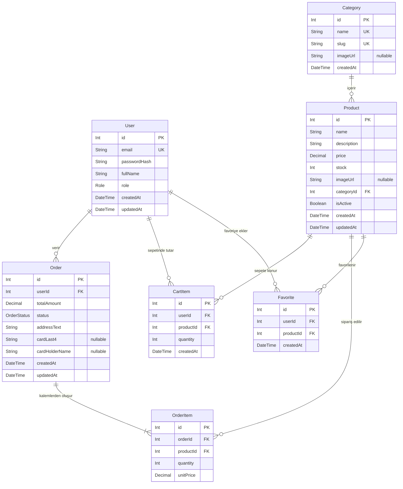

```mermaid
erDiagram
    User ||--o{ Order     : "verir"
    User ||--o{ CartItem  : "sepetinde tutar"
    User ||--o{ Favorite  : "favoriye ekler"

    Category ||--o{ Product : "içerir"

    Product ||--o{ CartItem  : "sepete konur"
    Product ||--o{ OrderItem : "sipariş edilir"
    Product ||--o{ Favorite  : "favorilenir"

    Order ||--|{ OrderItem : "kalemlerden oluşur"

    User {
        Int      id PK
        String   email UK
        String   passwordHash
        String   fullName
        Role     role
        DateTime createdAt
        DateTime updatedAt
    }

    Category {
        Int      id PK
        String   name UK
        String   slug UK
        String   imageUrl "nullable"
        DateTime createdAt
    }

    Product {
        Int      id PK
        String   name
        String   description
        Decimal  price
        Int      stock
        String   imageUrl "nullable"
        Int      categoryId FK
        Boolean  isActive
        DateTime createdAt
        DateTime updatedAt
    }

    CartItem {
        Int      id PK
        Int      userId FK
        Int      productId FK
        Int      quantity
        DateTime createdAt
    }

    Order {
        Int         id PK
        Int         userId FK
        Decimal     totalAmount
        OrderStatus status
        String      addressText
        String      cardLast4 "nullable"
        String      cardHolderName "nullable"
        DateTime    createdAt
        DateTime    updatedAt
    }

    OrderItem {
        Int     id PK
        Int     orderId FK
        Int     productId FK
        Int     quantity
        Decimal unitPrice
    }

    Favorite {
        Int      id PK
        Int      userId FK
        Int      productId FK
        DateTime createdAt
    }
```